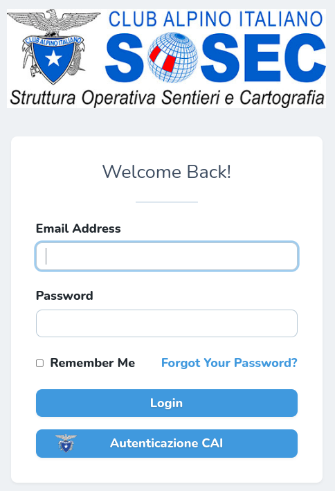

# Accesso

L’accesso alla piattaforma, raggiungibile al seguente URL [https://osm2cai.cai.it/](https://osm2cai.cai.it/), deve essere eseguito tramite la funzione di \[**Autenticazione CAI**], cioè utilizzando l’account MyCAI ([https://soci.cai.it/](https://soci.cai.it/)) messo a disposizione dal Club Alpino Italiano a tutti i suoi soci.

<figure><figcaption>
Pagina di login ad OSM2CAI
</figcaption></figure>

Gli amministratori, i referenti nazionali e i referenti regionali possono assegnare agli utenti un qualsiasi ambito territoriale.

L’utente senza un’associazione territoriale assegnata, avrà accesso alla piattaforma in sola modalità di consultazione.

<figure><figcaption>
Pagina che avvisa l'utente della modalità visualizzazione
</figcaption></figure>
