# APP del Sentierista

<figure>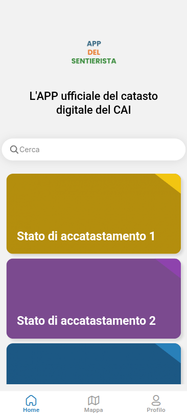<figcaption></figcaption></figure> <figure>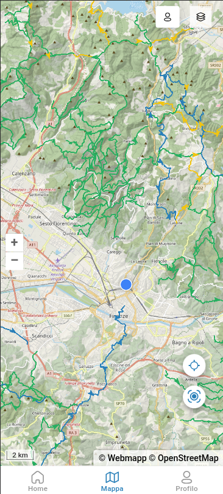<figcaption></figcaption></figure> <figure>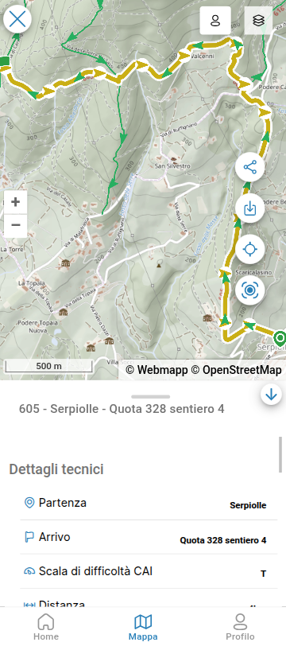<figcaption></figcaption></figure>

***

## Descrizione

L'APP del Sentierista sviluppata dal Club Alpino Italiano, mostra i percorsi presenti nel database OSM2CAI, suddivisi per [stato di accatastamento](definizioni/stato-di-accatastamento.md) (1, 2, 3 e 4). Per ogni percorso è possibile visualizzare oltre alla geometria anche gli altri metadati presenti del database, alcuni di questi sono calcolati in automatico (dislivello positivo e negativo, distanza, ecc) Nella scheda del percorso è presente il link diretto alla piattaforma OSM2CAI per verificare, aggiornare o validare il percorso.

#### Scarica l'APP del Sentierista


\[Android]



\[iOS]


## Rilievo

Tramite l'APP del Sentierista è possibile registrare le proprie attività, fare segnalazioni sulla Rete Sentieristica Italiana  e raccogliere punti di interesse (sorgenti, luoghi di posa della segnaletica verticale, ecc)

I dati raccolti utilizzando l'APP, quali punti di interesse (sorgenti, luoghi di posa, ecc), foto georeferenziate e tracce, possono essere visualizzati all'interno della piattaforma OSM2CAI, per essere elaborati. Fare riferimento alla Sezione apposita, raggiungibile qui:


[rilievi.md](../interfaccia-utente/resources/rilievi.md)


## Funzioni di registrazione&#x20;

<figure>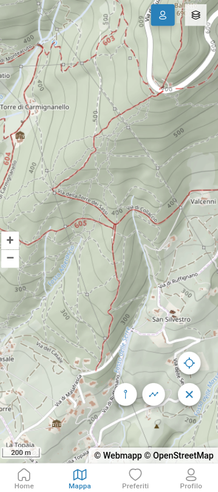<figcaption>
menu scelta azione: - registrare un waypoint - registrare una traccia
</figcaption></figure>

### Registrazione waypoint

<figure>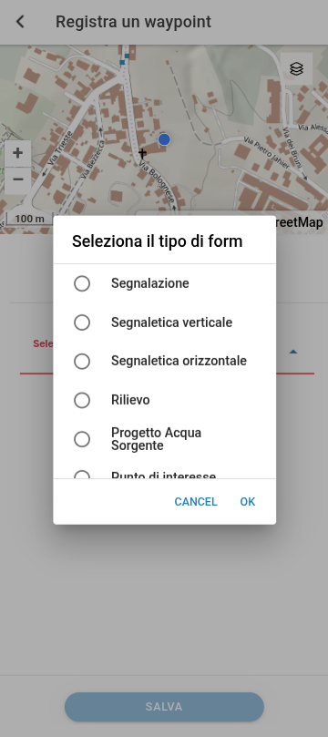<figcaption>
menu scelta tipo di form: - Segnalazione - Segnaletica verticale - Segnaletica orizzontale - Rilievo - Progetto Acqua Sorgente
</figcaption></figure>


Durante la compilazione dei dati relativi al waypoint è possibile associare una o più foto georeferenziate


#### Form \<Segnalazione>

<figure>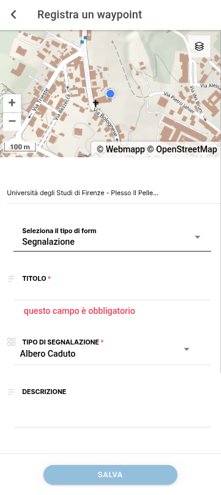<figcaption></figcaption></figure>

#### Form \<Segnaletica verticale>

<figure>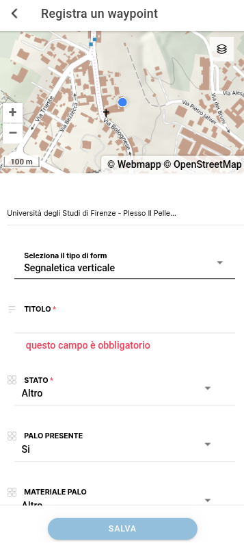<figcaption></figcaption></figure>

#### Form \<Segnaletica orizzontale>

<figure>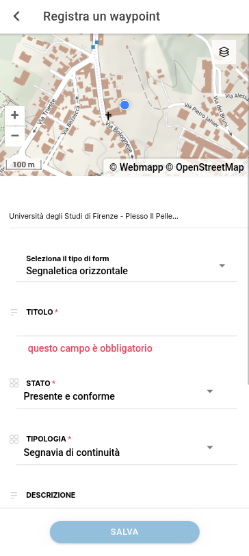<figcaption></figcaption></figure>

#### Form \<Rilievo>

<figure>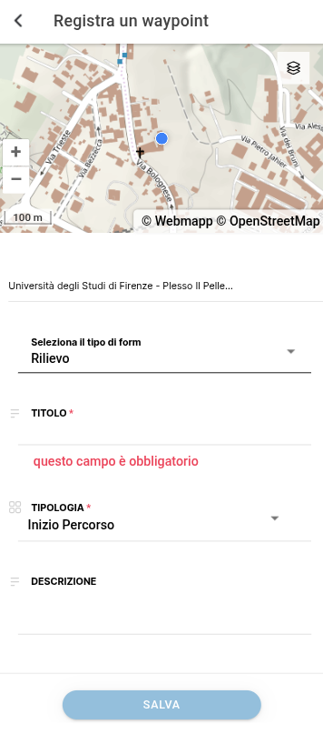<figcaption></figcaption></figure>

### Registrazione traccia

<figure>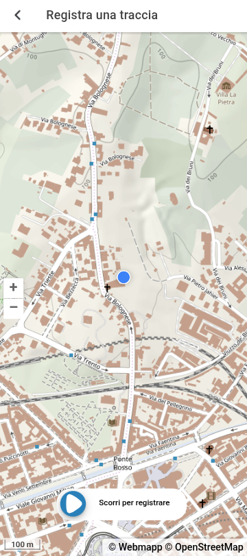<figcaption>
schermata &#x3C;inizio registrazione traccia>
</figcaption></figure> <figure>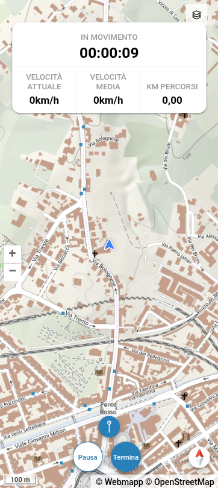<figcaption>
schermata durante la registrazione
</figcaption></figure>


Durante la registrazione di una traccia è anche possibile registrare un waypoint, direttamente dall'icona presente.


## Profilo utente

<figure><figcaption>
menu &#x3C;profilo utente>
</figcaption></figure> <figure><figcaption>
dettaglio traccia registrata, con possibilità di scaricamento
</figcaption></figure>

