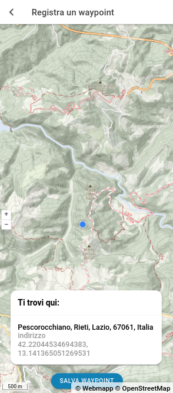

# APP del Sentierista

<figure><figcaption></figcaption></figure>

 

<figure><figcaption></figcaption></figure>

 

<figure><figcaption></figcaption></figure>

 

<figure><figcaption></figcaption></figure>

***

### Descrizione

L'APP del Sentierista sviluppata dal Club Alpino Italiano, mostra i percorsi presenti nel database OSM2CAI, suddivisi per [stato di accatastamento](definizioni/stato-di-accatastamento.md) (1, 2, 3 e 4). Per ogni percorso è possibile visualizzare oltre alla geometria anche gli altri metadati presenti del database, alcuni di questi sono calcolati in automatico (dislivello positivo e negativo, distanza, ecc) Nella scheda del percorso è presente il link diretto alla piattaforma OSM2CAI per verificare, aggiornare o validare il percorso.

#### Scarica l'APP del Sentierista


\[Android]



\[iOS]


### Rilievo

Tramite l'APP del Sentierista è possibile registrare le proprie attività, fare segnalazioni sulla Rete Sentieristica Italiana  e raccogliere punti di interesse (sorgenti, luoghi di posa della segnaletica verticale, ecc)

I dati raccolti utilizzando l'APP, quali punti di interesse (sorgenti, luoghi di posa, ecc), foto georeferenziate e tracce, possono essere visualizzati all'interno della piattaforma OSM2CAI, per essere elaborati. Fare riferimento alla Sezione apposita, raggiungibile qui:


[rilievi.md](../interfaccia-utente/resources/rilievi.md)


<figure><figcaption>
menu scelta azione: - registrare waypoint - registrare traccia - registare foto
</figcaption></figure>

#### Registrazione waypoint

<figure><figcaption>
schermata &#x3C;Registra un waypoint>
</figcaption></figure>

 

<figure><figcaption>
schermata &#x3C;categoria waypoint>
</figcaption></figure>

 

<figure><figcaption>
schermata &#x3C;tipologia waypoint>
</figcaption></figure>

#### Registrazione traccia

Durante la registrazione di una traccia è possibile registrare un waypoint.

<figure><figcaption>
schermata &#x3C;registra una traccia>
</figcaption></figure>

 

<figure><figcaption>
schermata durante la registrazione
</figcaption></figure>

#### Registrazione foto

È possibile scattare una foto o selezionarla dalla propria libreria.

<figure><figcaption>
schermata &#x3C;registrazione di una foto>
</figcaption></figure>
