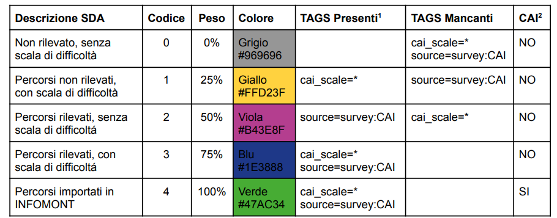

# Stato di accatastamento

Lo **Stato di accatastamento (SDA)** di un percorso deriva della presenza o meno dei tag cai\_scale o source=survey:CAI nelle corrispondenti relazioni di OpenStreetMap, come riassunto nella seguente tabella:

<figure><figcaption>
1 type=route, route=hiking, network=lwn, ref=* sempre presenti 2 validazione INFOMONT
</figcaption></figure>

Gli stati 0,1,2 e 3 vengono assegnati in maniera automatica dalla piattaforma OSM2CAI in fase di sincronizzazione, mentre lo stato 4 viene gestito manualmente dagli utenti abilitati.

## Condizioni minime per l’accatastamento di un percorso

Le condizioni minime affinché un percorso possa essere inserito nel “Catasto REI” sono le seguenti:

1. **Che presenti una elevata valenza paesaggistica, storico naturalistica oppure etno-antropologica documentata**: Lo scopo di questa prescrizione è quello di assicurarsi che si prediligano percorsi già noti che abbiano un valore evitando di inflazionare il catasto con troppi percorsi che poi rischiano di non essere fruiti
2. **Che non attraversi aree con un equilibrio geologico ed ecologico fragile certificato dagli Enti Territoriali competenti**: Onde evitare successive chiusure per motivi di sicurezza o per preservare ecosistemi fragili
3. **Che si svolga su viabilità in cui sia consentito esplicitamente o implicitamente il transito delle persone sia su aree pubbliche sia private evitando il più possibile tratti asfaltati percorsi anche da mezzi a motore**: Onde evitare successive chiusure e/contenziosi e problemi di sicurezza
4. **Che sia monitorato e mantenuto da soggetti pubblici o privati , sotto il profilo della percorribilità oppure che si mantenga in buone condizioni in modo naturale**: Onde evitare che il percorso sia rapidamente abbandonato per impraticabilità
5. **Sono comunque ammessi nel catasto anche altri percorsi che corrispondano a queste caratteristiche funzionali:**
   * collegamento intervallivo
   * connettività agli altri percorsi della rete
   * accesso a rifugi e strutture ricettive
