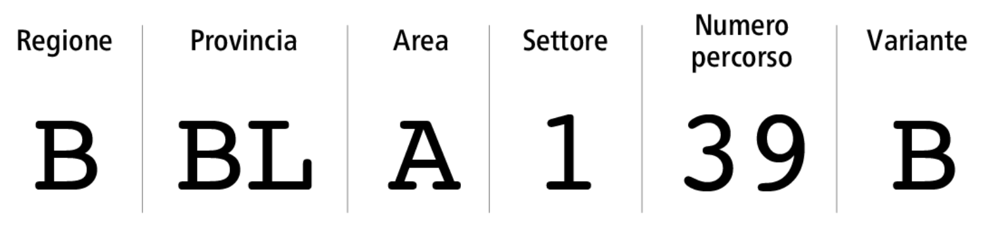

# Suddivisione territoriale

### Aree e Settori

Al fine di assegnare ai percorsi escursionistici un codice univoco, le province delle regioni italiane sono state suddivise in aree e settori. La aree vengono nominate con una lettera mentre i settori con un numero che va da 1 a 9. Se un’area deve essere suddivisa in più di nove settori, dal decimo viene utilizzata una lettera.

<figure><figcaption>
Suddivisione Aree e Settori
</figcaption></figure>


mappa web della suddivisione in Aree e Settori


###

***

### Codice REI

<figure><figcaption>
Esempio di codice REI
</figcaption></figure>

Il codice del percorso è caratterizzato da un codice ad otto caratteri, lettere e numeri, denominato codice REI.&#x20;

Le prime quattro lettere riguardano l’**inquadramento amministrativo**: la prima lettere definisce la regione, la seconda e la terza definiscono la sigla automobilistica della provincia, la quarta definisce il codice dell'area.

I secondi quattro caratteri rappresentano invece il **numero del percorso sul territorio**: la prima cifra contraddistingue il settore (da 1 a 9 oppure una lettera, escluso lo "0"). La seconda e la terza cifra rappresentano il numero del percorso (da 00 a 99).&#x20;

La quarta e ultima cifra di questa viene utilizzata per indicare le varianti e per i percorsi lunghi (un carattere alfanumerico lettera maiuscola per le varianti, numeri per le suddivisioni dei percorsi lunghi, “0” riservato per il percorso principale)&#x20;

<figure><figcaption>
esempio codice REI, con evidenziato il numero del percorso presente sul territorio
</figcaption></figure>

###

***

### Codici Regioni Italiane

Il Club Alpino italiano ha assegnato una lettera alle Regioni Italiane, al fine per la generazione delcodice interno CAI

| REGIONE               | CODICE CAI |
| --------------------- | ---------- |
| Abruzzo               | P          |
| Basilicata            | T          |
| Calabria              | U          |
| Campania              | S          |
| Emilia-Romagna        | H          |
| Friuli-Venezia Giulia | A          |
| Lazio                 | O          |
| Liguria               | G          |
| Lombardia             | D          |
| Marche                | M          |
| Molise                | Q          |
| Piemonte              | E          |
| Puglia                | R          |
| Sardegna              | Z          |
| Sicilia               | V          |
| Toscana               | L          |
| Trentino-Alto Adige   | C          |
| Umbria                | N          |
| Valle d'Aosta         | F          |
| Veneto                | B          |
